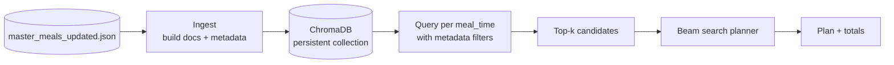

# Diet Plan Studio (React + FastAPI)

This is a self-contained workspace that includes:
- a **React + Vite** frontend (`frontend/`) and
- a **FastAPI** backend (`backend/`) that owns all meal-planning logic.

The optional `rag_meals_py/` folder contains experiments/utilities for vector retrieval (RAG-style) and is not required to run the Studio UI.

---

## 1) One-paragraph summary (for invention disclosure)

This project generates **personalized, multi-day diet plans** by combining (a) deterministic **nutrition target computation** (BMI/BMR/TDEE + macro targets) with (b) **constraint-aware meal selection** from a structured meal dataset. It supports meal-time slots (early morning → bedtime), goal-based filtering (e.g., skin/hair repair), dietary preference filtering (veg/non-veg), and allergy keyword exclusion. The planner uses a macro-aware scoring function and a beam-search over meal-time choices to approximate target calories/macros per day. An optional Python module indexes the meal dataset into **ChromaDB** with embeddings from **sentence-transformers/all-MiniLM-L6-v2** to enable retrieval-augmented candidate selection.

---

## 2) What’s inside this folder

`Diet Plan/` contains three main parts:

1) **React frontend**: `Diet Plan/frontend/`
  - UI for user inputs and displaying generated plan(s)
  - UI/UX only: calls the Python backend for targets, ranking, plan-building, and substitutions
  - In dev, Vite proxies `/api` to `http://127.0.0.1:8000`

2) **Meal dataset and auxiliary data**: `Diet Plan/data/`
  - Primary dataset: `master_meals_updated.json`
  - Allergens & substitutions: `master_allergens.json`, `master_substituents.json`
  - Reference documents (e.g., `.docx`) used during dataset preparation

3) **Optional RAG / vector retrieval module (Python)**: `Diet Plan/rag_meals_py/`
  - Ingests `master_meals_updated.json` into a persistent **ChromaDB** collection
  - Embeds meals with **sentence-transformers/all-MiniLM-L6-v2**
  - Retrieves top-k candidates with metadata filters (meal_time/goal/diet_type)

---

## 3) High-level architecture

### 3.1 React + FastAPI (current)

The current experience is a React SPA that delegates all meal logic to the FastAPI backend:

```mermaid
flowchart LR
  U[User Inputs] --> UI[React UI: Diet Plan/frontend]
  UI --> API[/api/studio/* endpoints]
  API --> N[Nutrition Calculator
  BMI/BMR/TDEE + macro targets]
  API --> P[Planner
  ranking + selection + plan build]
  D[(master_meals_updated.json)] --> API
  API --> R[Multi-day plan output
  per-day nutrients + meals]
  UI --> R
```

> Note: Legacy React-side planner utilities may still exist in `Diet Plan/frontend/src/lib/`, but the app is now wired to use the backend.

### 3.2 Running locally (dev)

1) Start the Python backend (recommended: create the venv at repo root so there is only one `requirements.txt` to install)

From the `Diet Plan/` folder:

`python -m venv .venv`

`./.venv/Scripts/Activate.ps1` (Windows PowerShell)

`pip install -r requirements.txt`

`cd backend`

`python -m uvicorn app:app --reload --port 8000`

2) Start the React frontend:

`cd Diet Plan/frontend`

`npm install`

`npm run dev`

Open `http://localhost:5173/`. If Vite reports the port is already in use, stop the other dev server using `5173` and re-run `npm run dev`.

### 3.3 Optional RAG-style retrieval (Python module)

This is a separate implementation path for candidate retrieval (useful if the dataset becomes large or if you want semantic search):



---

## 4) Data: `Diet Plan/data/`

### 4.1 Primary dataset: `master_meals_updated.json`

This is the single source of truth for the planner. Each entry represents a meal with:
- `Meal_ID` (string like `MEAL_000001`)
- `meal_name`
- `meal_time` (one of: `early_morning`, `breakfast`, `mid_morning`, `lunch`, `evening`, `dinner`, `bedtime`)
- `goal` (e.g., `skin_repair`, `hair_repair` — normalized to stable tokens)
- `diet_type` (`veg`, `non_veg`, or empty)
- `ingredients`, `method`, `serving_size`, `time`, `caution`
- `nutritive_values` (a standardized human-readable macro string)

### 4.2 `nutritive_values` format (important)

The planners parse macros from the `nutritive_values` string, which is expected to be in the shape:

```
"360 kcal | Protein 24 g | Carbs 24 g | Fat 18 g"
```

Fiber is optional but supported if present:

```
"210 kcal | Protein 2 g | Carbs 48 g | Fat 0 g | Fiber 6 g"
```

If nutrition strings are missing or inconsistent, macro matching accuracy decreases.

### 4.3 Allergens/substitutions

- `master_allergens.json`: used to maintain standardized allergen naming and mapping.
- `master_substituents.json`: used to maintain optional substitutions.

The React planner currently uses **keyword matching** against `ingredients` and `caution` to exclude meals.

---

## 5) Nutrition calculations (targets)

The current implementation lives in `backend/studio/nutrition.py` and is exposed via `POST /api/studio/targets`.

### 5.1 BMI

Let $h = \frac{\text{height\_cm}}{100}$.

$$\text{BMI} = \frac{\text{weight\_kg}}{h^2}$$

### 5.2 BMR (Harris–Benedict)

- Male: $\text{BMR} = 66 + (13.7w) + (5h) - (6.8a)$
- Female: $\text{BMR} = 655 + (9.6w) + (1.8h) - (4.7a)$

Where:
- $w$ = weight (kg)
- $h$ = height (cm)
- $a$ = age (years)

### 5.3 TDEE

$$\text{TDEE} = \text{BMR} \times \text{activity\_multiplier}$$

Activity multipliers:
- Sedentary: 1.2
- Light: 1.375
- Moderate: 1.55
- Heavy: 1.725

\mathrm{carbs_g} = \frac{\text{daily_calories} - (\text{protein_g}\times 4) - (\text{fat_g}\times 9)}{4}

This build uses a **fixed target BMI** of $22$.

Let $h = \frac{\text{height\_cm}}{100}$. Target weight is:

$$\text{target\_weight\_kg} = 22 \times h^2$$

This build does **not** use timeline-based calorie adjustment.

Daily calories are set to maintenance calories (TDEE), with a conservative safety minimum:

$$\text{daily\_calories} = \max(1200, \text{TDEE})$$

### 5.5 Daily macro targets (based on target weight)

All macros are computed from **target weight** (not current weight) and adjusted by BMI category:

- Protein grams:

$$\text{protein\_g} = p \times \text{target\_weight\_kg}$$

Where default $p$ presets are:
- Underweight: $p=1.6$
- Normal: $p=1.2$
- Overweight: $p=1.4$
- Obese: $p=1.6$

- Fat grams:

$$\text{fat\_g} = \frac{(\text{daily\_calories} \times f)}{9}$$

Where $f$ is chosen by BMI category (lower for overweight/obese, higher for underweight), bounded by general adult AMDR guardrails.

Default fat% presets used by this project (min / max / default):
- Underweight: 25% / 35% / 32%
- Normal: 25% / 35% / 28%
- Overweight: 20% / 30% / 22%
- Obese: 20% / 30% / 20%

- Carbs grams (remainder):

$$

\mathrm{carbs\_g} = \frac{\text{daily\_calories} - (\text{protein\_g}\times 4) - (\text{fat\_g}\times 9)}{4}
$$

### 5.6 Fiber + water heuristics

- Fiber: $14\,g$ per $1000$ kcal (minimum clamp: $25\,g/day$)
- Water: $\text{target\_weight\_kg} \times (30\text{ to }35)\,ml/day$ (the UI also shows a single representative value)

## 6) React UI (`Diet Plan/frontend/`)

### 6.1 UX flow

The app is a SPA with a multi-step flow:

1) **Inputs & meal times**
  - Age, gender, height, weight
  - Goal selection, activity level, diet preference
  - Allergies (comma-separated)
  - Plan length selector (7 / 14 / 21 days)
  - Meals/day selector + explicit meal-time selection
  - Live computed BMI/BMR/TDEE + targets

2) **Choose meals**
  - Shows top options per meal time; user selects a unique pool sized to plan length
  - Per meal-time refresh updates only that section

3) **Arrange days**
  - Re-assign/swap the chosen meals across Day 1..N

4) **Plan**
  - Renders the final day-wise plan; meal cards include nutritive values and recipe fields

### 6.2 Frontend planning entrypoint

The UI calls `generateMealPlan()` from `Diet Plan/frontend/src/lib/planner.js`.

Each click generates a fresh seed so repeated generations are randomized even if the dataset is small.

---

## 7) Planner algorithm (JavaScript) — `Diet Plan/frontend/src/lib/planner.js`

### 7.1 Constraints and filters

For each meal-time slot, candidates are filtered by:
- `meal_time` exact match
- `goal` exact match (normalized)
- `dietType`:
  - `veg`: excludes meals explicitly marked `non_veg` and also excludes meals with missing `diet_type` that look non-veg from ingredients/name heuristics
  - `non_veg`: excludes meals explicitly marked `veg`
  - `any`: no diet constraint
- allergies: excludes meals where `ingredients` or `caution` contains any keyword

### 7.2 Meal-time distribution

The planner targets calories/macros per slot using a fixed day distribution:

- early_morning: 5%
- breakfast: 30%
- mid_morning: 10%
- lunch: 25%
- evening: 10%
- dinner: 15%
- bedtime: 5%


## 8) How to run

### 8.1 Run the React app

From `Diet Plan/frontend`:

```bash
npm install
npm run dev
```

### 8.2 (Optional) Run Python RAG ingestion/planning

This repo’s main backend is outside `Diet Plan/`, but `rag_meals_py` is self-contained as a module.

At minimum you need:
- Python 3.10+ recommended
- `chromadb`
- `sentence-transformers`

Then you can import it from Python and call `ensure_ingested()`.

---

## 9) Folder structure (Diet Plan only)

```
Diet Plan/
  app/                # React UI (Vite)
  data/               # master_meals_updated.json + allergen/substitution data
  rag_meals_py/       # Optional Python RAG indexing + planner (ChromaDB)
  README.md           # This file
```

