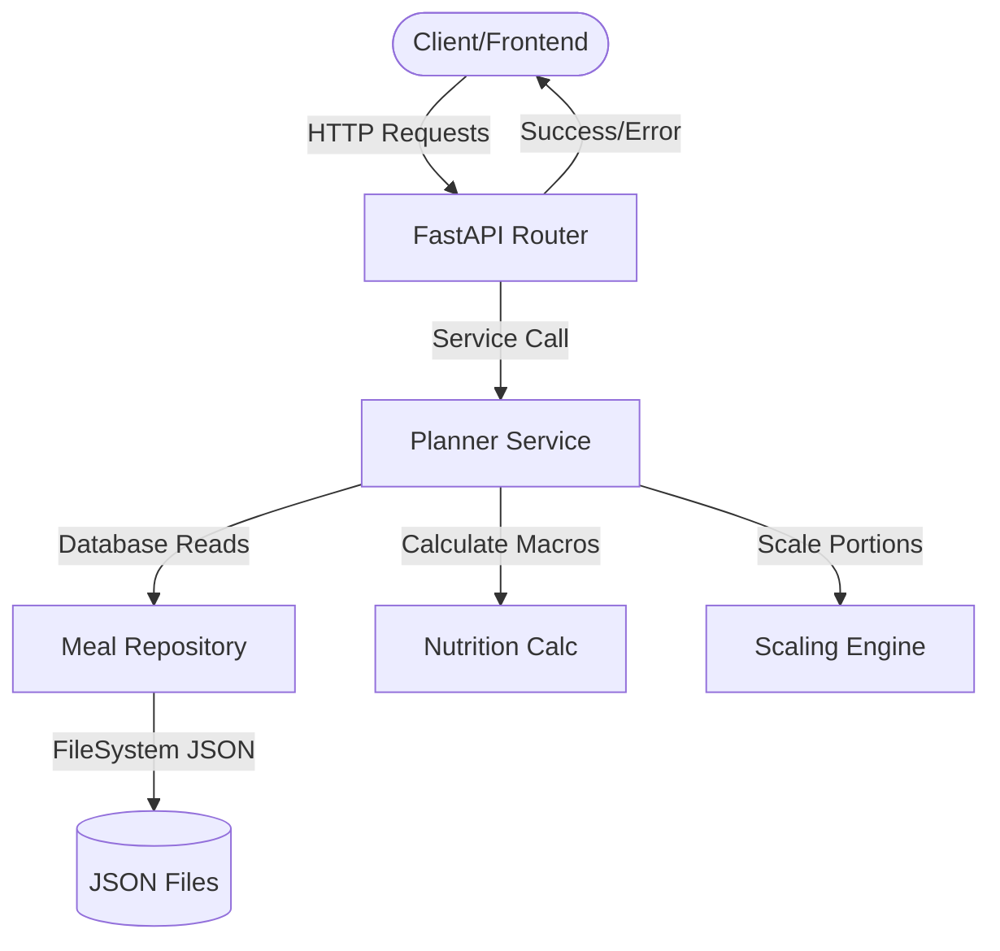

# Diet Plan Studio Architecture

This document details the backend architectural design of the Diet Plan Studio application.

## Directory Structure

```text
backend/
├── ai/
│   └── ai_agent.py          # Chatbot logic, intent parser & Ollama wrapper
├── config/
│   ├── errors.py            # Global exception handlers & middleware
│   ├── logging.py           # Structured logging configuration
│   └── settings.py          # Environment settings using pydantic-settings
├── repositories/
│   └── meal_repository.py   # JSON file-based database access, caching, data normalization
├── services/
│   └── planner_service.py   # Business logic orchestration layer
├── studio/
│   ├── chat.py              # Chat API endpoint
│   ├── meals.py             # Meal ranking, filtering, and allowance rules
│   ├── nutrition.py         # BMR, TDEE, BMI, macro target formulas
│   ├── router.py            # Planner, profile, and swapping routes
│   └── scaling.py           # Meal portions and macro scaling rules
└── app.py                   # App startup and CORS middleware registration
```

---

## Core Components

### 1. API & Routing Layer
* **`app.py`**: Initiates the FastAPI application, sets up CORS middleware for the frontend developer port, and mounts routing modules.
* **`studio/router.py`**: Hosts endpoints for generating ranked meals, loading available options, and performing swaps.
* **`studio/chat.py`**: Directs chat requests to the conversational AI layer.

### 2. Services Layer
* **`services/planner_service.py`**: Functions as a clean interface decoupling the endpoints from detailed mathematical scaling and repository query steps.

### 3. Repository Layer
* **`repositories/meal_repository.py`**: Standardizes paths to raw JSON meal plans, normalizes diet type inputs, filters allergen matches, and caches records using `@lru_cache` to minimize disk read operations.

### 4. Configuration & Logging (Hardened)
* **`config/settings.py`**: Uses `pydantic-settings` to bind environment settings (such as Ollama models or cache sizes) starting with `NUTRI_`.
* **`config/logging.py`**: Configures console logging dictionary formats so exceptions are logged uniformly.
* **`config/errors.py`**: Catch validation and system faults globally to reply with clean standard response envelopes without leaking server stack traces to clients.

---

## Data Flow Pipeline



1. **Daily Targets**: Client sends demographic parameters. `nutrition.py` runs Harris-Benedict formulas to yield calorie and macro targets.
2. **Meal Ranking**: Service queries candidate meals from `meal_repository.py` matching goal/diet parameters, then scales portions to achieve targets.
3. **Conversational Agent**: Messages flow to `ai_agent.py` to parse intents (like "swap breakfast" or "page 2") or query the Ollama model.
